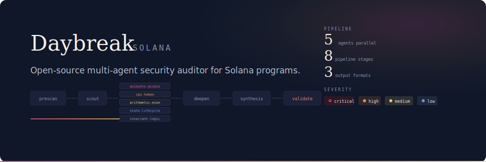

<p align="center">
  
</p>

<p align="center">
  <strong>Open-source multi-agent security auditor for Solana programs.</strong><br>
  <sub>Five specialized Claude-powered agents analyze your code in parallel, preceded by static analysis, and present findings in a triage dashboard with PDF/Markdown export.</sub>
</p>

<p align="center">
  <a href="https://daybreaksec.com">daybreaksec.com</a> &middot;
  <a href="#getting-started">getting started</a> &middot;
  <a href="#pipeline">pipeline</a> &middot;
  <a href="LICENSE">apache 2.0</a>
</p>

---

## Pipeline


**Prescan** extracts structural data using tree-sitter, ast-grep rules, clippy, and cargo-audit. Outputs feed into agents as prioritized context.

**Scout** maps program structure: instructions, accounts, access control patterns, data flows.

**Five scanning agents** run in parallel, each covering a vulnerability domain:

| Agent | Domain | Covers |
|-------|--------|--------|
| `accounts-access` | Account validation | Missing signer checks, PDA validation, ownership confusion |
| `cpi-token` | Cross-program invocation | Unsafe CPI, token operation misuse, authority escalation |
| `arithmetic-economic` | Math & economics | Overflow, precision loss, flash loan, oracle manipulation |
| `state-lifecycle` | State machines | Initialization, reinitialization, account closure, rent |
| `invariant-logic` | Business logic | Conservation laws, constraint violations, logic errors |

**Threat model** runs alongside agents, producing a security architecture map: actors, trust boundaries, invariants, attack surfaces.

**Deepening** re-runs owning agents on high/critical findings for focused re-analysis with full source context.

**Synthesis** looks across all findings for compound vulnerabilities and coverage gaps that no single agent would catch.

**Validation** is a pessimistic adversarial agent that tries to disprove every finding before it reaches the dashboard.

## Getting Started

See [GETTING-STARTED.md](GETTING-STARTED.md) for full setup instructions.

### Local

```bash
npm run setup              # check deps, install packages
claude auth login          # one-time browser login
npm run dev                # server :3000 + client :5173
```

### Docker

```bash
docker compose up -d
docker compose exec daybreak claude auth login    # one-time browser login
# open http://localhost:3000
```

### Authentication

Daybreak uses the Claude Code CLI for authentication. Running `claude` once opens a browser-based OAuth flow that persists credentials locally. In Docker, the `claude-auth` volume keeps the session across container restarts.

## Requirements

| Tool | Required | Notes |
|------|----------|-------|
| Node.js 20+ | Yes | Server runtime, client build |
| Python 3.9+ | Yes | tree-sitter prescan extractors |
| Claude CLI | Yes | `npm install -g @anthropic-ai/claude-code` |
| ast-grep | No | Pattern rules skipped if missing |
| cargo | No | Clippy + cargo-audit skipped if missing |
| Docker 20.10+ | No | Alternative to local setup |

## Remote Access

If you're running Daybreak on a remote server, use an SSH tunnel to access the dashboard:

```bash
ssh -L 5173:localhost:5173 -L 3000:localhost:3000 user@your-server-ip
```

Then open `http://localhost:5173` (dev mode) or `http://localhost:3000` (production) in your local browser.

To make this persistent, add to `~/.ssh/config`:

```
Host daybreak-server
  HostName your-server-ip
  User your-username
  LocalForward 5173 localhost:5173
  LocalForward 3000 localhost:3000
```

## About Daybreak

Daybreak provides embedded security engineering for emerging tech companies. Rather than point-in-time audits, Daybreak operates as a continuous security presence -- reviewing code as it evolves, producing threat models, and maintaining full context across the product lifecycle.

This tool is how we work. We open-sourced it so every team can run the same pipeline we use in production engagements.

<p align="center">
  <a href="https://daybreaksec.com">daybreaksec.com</a> &middot; <a href="mailto:colin@daybreaksec.com">colin@daybreaksec.com</a>
</p>

## License

Apache 2.0 -- see [LICENSE](LICENSE).
